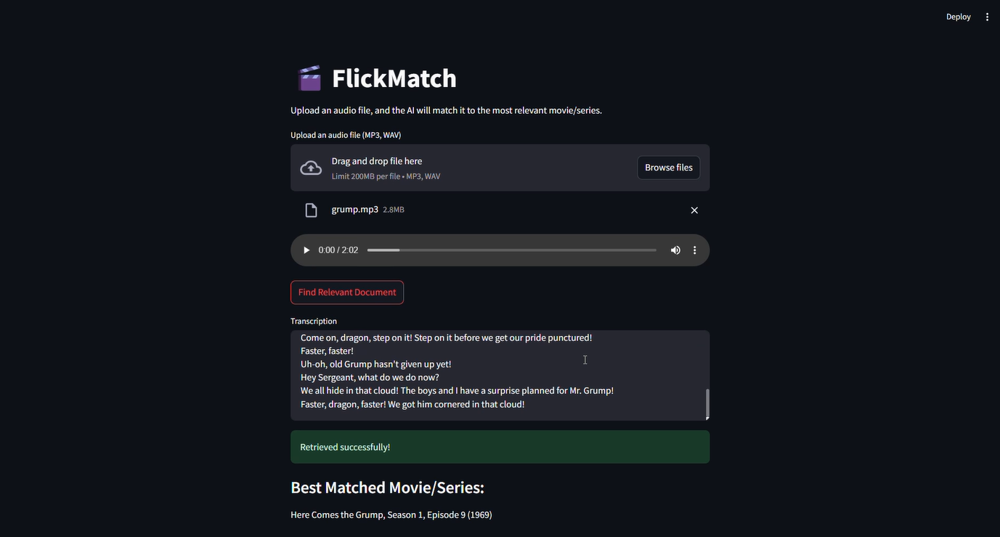

# 🎬 FlickMatch

**FlickMatch** is a smart AI-powered app that helps you identify the **most relevant movie or series** by analyzing uploaded **audio clips**. Whether it's a snippet of dialogue or narration, FlickMatch finds the best match using **AI transcription** and **semantic search**.



---

## 🚀 Features

- 🔊 Upload audio clips in `.mp3` or `.wav` format
- 🤖 Transcribes audio using OpenAI’s `gpt-4o-transcribe`
- 🔍 Uses vector similarity search with HuggingFace embeddings
- 🎯 Retrieves the most relevant movie/series with title, year, and episode/season info
- 🧠 Built with **LangChain**, **ChromaDB**, **Streamlit**, and **OpenAI API**

---

## 🛠️ How It Works

1. **Upload** an audio file (dialogue or narration).
2. **Transcription** is done via OpenAI's transcription model.
3. The transcript is **split and embedded** using `all-mpnet-base-v2`.
4. **Semantic search** is performed on a Chroma vector database.
5. The most relevant movie/series info is displayed — including title, year, season, and episode!

---

## 🖼️ UI Preview

<p align="center">
  
</p>

---

## 🧰 Tech Stack

- [Streamlit](https://streamlit.io/)
- [LangChain](https://www.langchain.com/)
- [ChromaDB](https://www.trychroma.com/)
- [HuggingFace Transformers](https://huggingface.co/)
- [OpenAI API](https://platform.openai.com/)
- Python 3.10+

---

## 📝 Installation

```bash
# Clone the repo
git clone https://github.com/your_username/flickmatch.git
cd flickmatch

# Create a virtual environment
python -m venv venv
source venv/bin/activate  # or venv\Scripts\activate on Windows

# Install dependencies
pip install -r requirements.txt
